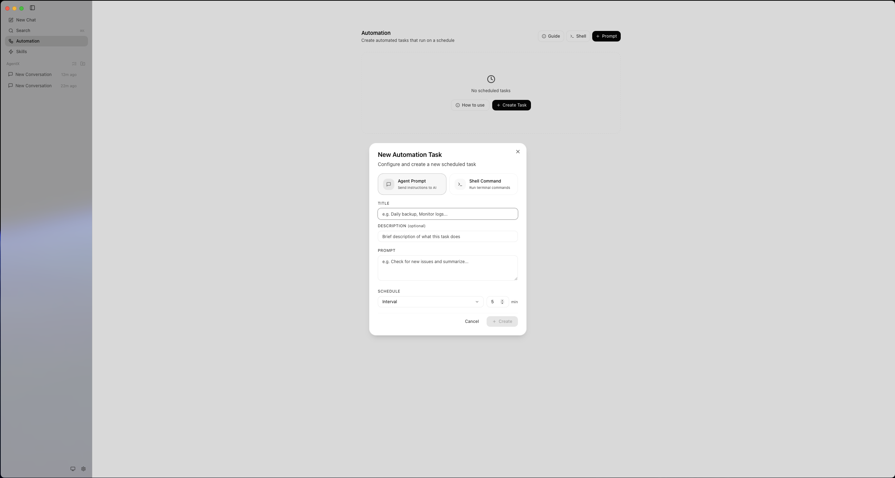
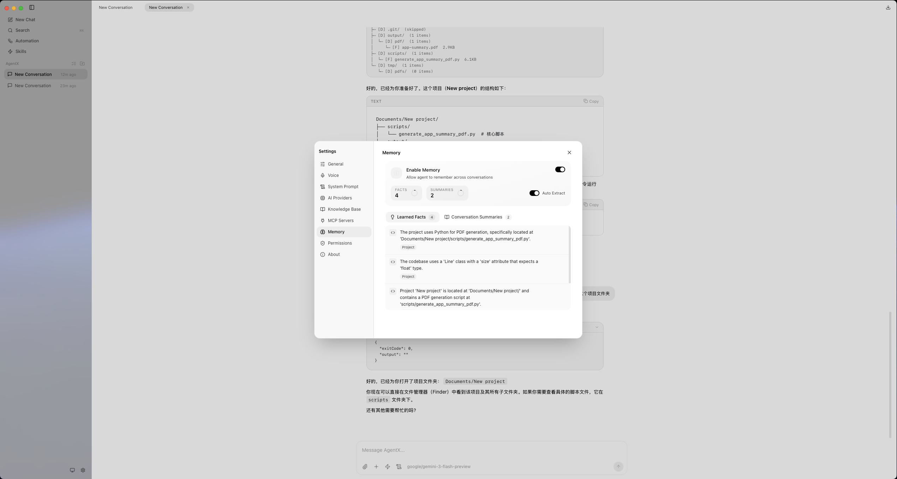

<p align="center">
  
</p>

<h1 align="center">AgentX</h1>

<p align="center">
  Open-source, local-first, multi-modal AI agent for your desktop.
  <br />
  File system access &middot; Shell execution &middot; Extensible toolkits &middot; Multi-provider
</p>

<p align="center">
  <a href="https://github.com/axelulu/agentx/releases/latest">
    
  </a>
  &nbsp;
  <a href="https://github.com/axelulu/agentx/releases/latest">
    
  </a>
  &nbsp;
  <a href="LICENSE">
    
  </a>
</p>

<p align="center">
  <a href="https://github.com/axelulu/agentx/releases/latest">Download Latest Release</a> &middot;
  <a href="#features">Features</a> &middot;
  <a href="#quick-start">Quick Start</a> &middot;
  <a href="#architecture">Architecture</a> &middot;
  <a href="#contributing">Contributing</a> &middot;
  <a href="#license">License</a>
</p>

---

## Screenshots






---

## Download

Download the latest version from the [Releases page](https://github.com/axelulu/agentx/releases/latest):

| Platform                  | File                     |
| ------------------------- | ------------------------ |
| **macOS** (Apple Silicon) | `AgentX-x.x.x-arm64.dmg` |
| **macOS** (Intel)         | `AgentX-x.x.x-x64.dmg`   |

> **Note:** AgentX currently only supports macOS. Windows and Linux are not supported.

> Open the `.dmg` and follow the installer. On first launch, go to **Settings > Providers** to add your API key.

## What is AgentX?

AgentX is a **local-first, general-purpose AI agent** that runs as a native desktop application. Unlike cloud-only assistants, AgentX operates directly on your machine — reading and writing files, executing shell commands, and completing multi-step tasks autonomously through a turn-based reasoning loop.

It supports multiple LLM providers, a pluggable toolkit system, and intelligent context window management — all wrapped in a clean, modern UI.

## Features

### Local Tool Execution

- **File system access** — Read, create, and rewrite files anywhere on your machine, sandboxed to your workspace.
- **Shell commands** — Execute arbitrary shell commands and scripts with full stdout/stderr capture.
- **No cloud relay** — Tools run locally on your OS. Nothing leaves your machine except LLM API calls.

### Multi-Provider Support

Connect your own API keys. AgentX supports:

| Provider          | Default Model              | Notes                                        |
| ----------------- | -------------------------- | -------------------------------------------- |
| **OpenAI**        | `gpt-4o`                   | Also compatible with Azure, OpenRouter, vLLM |
| **Anthropic**     | `claude-sonnet-4-20250514` | Native Anthropic SDK                         |
| **Google Gemini** | `gemini-2.0-flash`         | Google AI Studio                             |
| **Custom**        | —                          | Any OpenAI-compatible endpoint               |

Switch between providers at any time. Each conversation remembers its provider context.

### Autonomous Agent Loop

AgentX uses a **turn-based agent loop** — the LLM reasons, calls tools, observes results, and continues until the task is complete:

```
User message
  → LLM reasoning
    → Tool calls (parallel or sequential)
      → Tool results
        → LLM reasoning (next turn)
          → ... repeat until task complete
```

- Up to **50 turns** per invocation (configurable)
- **Parallel tool execution** with concurrency control
- **Streaming responses** with real-time UI updates
- **Abort** any running task at any time
- **Steer** the agent mid-execution by injecting messages
- **Follow-up queue** — send new messages while the agent is still running

### Smart Context Management

Long conversations are automatically optimized to fit within token budgets:

1. **Tool result compression** — Long outputs are truncated (head + tail)
2. **Gradient compression** — Older tool call groups are progressively removed
3. **LLM summarization** — Older history is condensed into a summary
4. **Fallback truncation** — Graceful degradation when all else fails

Default context budget: **100,000 tokens**, keeping the 5 most recent turns uncompressed.

### Extensible Toolkit

Tools and prompts are defined in **YAML**, making it easy to add new capabilities without touching code:

```
resources/toolkit/
├── prompts/         # System prompt templates (i18n-ready)
├── capabilities/    # Tool groups (file, shell, ...)
│   └── desktop/
│       ├── file/    # file_read, file_create, file_rewrite
│       └── shell/   # Shell execution tools
├── skills/          # High-level skill bundles
└── config/          # Global variables
```

Each capability includes:

- **Tool definitions** — Name, description, input schema (JSON Schema)
- **Prompt rules** — Contextual guidelines injected into the system prompt
- **Handlers** — TypeScript functions that implement the tool logic

### Middleware System

Extend the agent loop with custom middleware hooks:

```typescript
interface AgentMiddleware {
  beforeModelCall?: (ctx) => Promise<LLMMessage[] | void>;
  afterModelCall?: (ctx) => Promise<boolean | void>; // return true to stop
  beforeToolExecution?: (ctx) => Promise<Record<string, unknown> | void>;
  afterToolExecution?: (ctx) => Promise<void>;
}
```

Built-in: `createContextMiddleware()` for automatic context optimization.

### MCP Server Integration

Connect external [Model Context Protocol](https://modelcontextprotocol.io) servers to extend the agent with additional tools and resources — databases, APIs, custom services, and more.

### Knowledge Base

Add persistent context entries (facts, preferences, project conventions) that are injected into every conversation. The agent always has access to your most important information.

### Desktop Experience

- Native application for **macOS**
- Conversation management with auto-categorized icons
- Real-time streaming with typing indicators
- Message actions (copy, edit, regenerate)
- Dark theme optimized for extended use
- Lightweight — built with Tauri v2 + React 19

### macOS System Permissions

On macOS, AgentX can request system permissions to unlock advanced capabilities:

- **Accessibility** — Control your computer and interact with apps
- **Screen Recording** — Capture screen content for visual context
- **Microphone / Camera** — Voice and visual input
- **Full Disk Access** — Read and write files across the entire system
- **Automation** — Control other applications via AppleScript
- **Notifications** — Desktop notifications

Go to **Settings > Permissions** to grant each permission directly from the app.

## Quick Start

### Prerequisites

- **Node.js** >= 20
- **pnpm** 10.4.1+

### Install & Run

```bash
# Clone
git clone https://github.com/axelulu/agentx.git
cd agentx

# Install dependencies
pnpm install

# Start development mode
pnpm dev
```

The app will open automatically. Add your LLM provider API key in **Settings** to start chatting.

### Build for Production

```bash
pnpm --filter agentx dist:mac
```

Build artifacts are output to `packages/agentx/src-tauri/target/release/bundle/`.

## Architecture

AgentX is a modular **pnpm monorepo** with clear separation of concerns:

```
agentx/
├── packages/
│   └── agentx/                  # Tauri v2 desktop app
│       ├── src-tauri/           #   Rust backend (Tauri commands)
│       ├── src/                 #   React UI (Redux, Tailwind)
│       └── resources/toolkit/   #   YAML prompt & tool definitions
│
├── packages/
│   ├── agent/                   # Core agent loop (stateless)
│   │   ├── agent-loop.ts        #   Turn-based reasoning loop
│   │   ├── agent.ts             #   Stateful wrapper class
│   │   ├── tool-executor.ts     #   Parallel/sequential tool runner
│   │   └── middleware.ts        #   Composable middleware system
│   │
│   ├── toolkit/                 # YAML-driven prompt & tool system
│   │   ├── toolkit.ts           #   Main facade
│   │   ├── prompt-service.ts    #   Template parsing + variable substitution
│   │   ├── tool-service.ts      #   Tool definition registry
│   │   └── capability-registry/ #   Capability/skill scanner
│   │
│   ├── context/                 # Context window optimization
│   │   ├── context-manager.ts   #   Orchestrator
│   │   └── compression/         #   Tool compression, gradient, summarization
│   │
│   ├── desktop/                 # Desktop-specific runtime
│   │   ├── runtime.ts           #   DesktopRuntime facade
│   │   ├── providers/           #   OpenAI, Anthropic, Gemini adapters
│   │   ├── conversations/       #   JSON file persistence
│   │   ├── sessions/            #   Session runner (agent + events)
│   │   └── handlers/            #   File & shell tool implementations
│   │
│   ├── l10n/                    # Internationalization framework
│   └── l10n-cli/                # Translation CLI
```

### Data Flow

```
┌──────────────┐     IPC      ┌──────────────────┐
│   Renderer   │ ◄──────────► │   Main Process   │
│  (React UI)  │   events     │  (IPC handlers)  │
└──────────────┘              └────────┬─────────┘
                                       │
                              ┌────────▼─────────┐
                              │  DesktopRuntime   │
                              │  ┌─────────────┐  │
                              │  │   Toolkit    │  │  YAML prompts + tools
                              │  ├─────────────┤  │
                              │  │   Agent      │  │  Turn-based loop
                              │  │   Loop       │──┤──► Tool Executor
                              │  ├─────────────┤  │
                              │  │  Context     │  │  Token optimization
                              │  │  Manager     │  │
                              │  ├─────────────┤  │
                              │  │  Provider    │──┤──► OpenAI / Anthropic / Gemini
                              │  │  Manager     │  │
                              │  └─────────────┘  │
                              └───────────────────┘
```

## Configuration

### LLM Providers

Open **Settings > Providers** in the app to add your API keys. You can configure multiple providers and switch between them.

For custom OpenAI-compatible endpoints (Ollama, vLLM, LM Studio, etc.), use the **Custom** provider type with your local base URL.

### Toolkit Capabilities

The toolkit automatically discovers capabilities in `resources/toolkit/capabilities/`. Each capability is a directory with:

```yaml
# capabilities/desktop/file/tools/prompts/en.yaml
meta:
  name: File Tools
  version: "1.0"
tools:
  - name: file_read
    description: "Read entire file content"
    category: desktop
    input_schema:
      type: object
      properties:
        file_path:
          type: string
          description: "Absolute path to the file"
      required: [file_path]
```

To add a new tool:

1. Create a directory under `capabilities/`
2. Add `tools/prompts/en.yaml` with the tool definition
3. Add `prompts/en/rules.yaml` with usage guidelines
4. Register a handler in `packages/desktop/src/handlers/`

### Agent Parameters

| Parameter           | Default | Description                            |
| ------------------- | ------- | -------------------------------------- |
| `maxTurns`          | 50      | Maximum reasoning turns per invocation |
| `maxTokens`         | 8192    | Max tokens per LLM response            |
| `temperature`       | 0.7     | Sampling temperature                   |
| `maxContextTokens`  | 100,000 | Context window budget                  |
| `recentTurnsToKeep` | 5       | Uncompressed recent turns              |
| `toolChoice`        | `auto`  | `auto`, `required`, or `none`          |

## Tech Stack

| Layer       | Technology                                             |
| ----------- | ------------------------------------------------------ |
| **Desktop** | Tauri v2, Vite, Rust                                   |
| **UI**      | React 19, Redux Toolkit, Tailwind CSS 4, Radix UI      |
| **Agent**   | Custom turn-based loop with streaming EventStream      |
| **LLM**     | OpenAI SDK 5 (also used for Anthropic/Gemini adapters) |
| **Build**   | pnpm workspaces, Turborepo, TypeScript 5.7             |
| **Test**    | Vitest 4                                               |
| **CI/CD**   | GitHub Actions (lint, type-check, test, macOS build)   |

## Project Commands

```bash
pnpm dev              # Start app in development mode
pnpm build            # Build all packages
pnpm build:prod       # Production build
pnpm lint             # Lint all packages
pnpm type-check       # TypeScript type checking
pnpm test             # Run tests
pnpm format           # Format with Prettier
pnpm clean            # Remove build artifacts
```

## Contributing

Contributions are welcome! Please follow the existing code conventions:

1. **Fork** the repository
2. **Create a branch** from `main`
3. **Make your changes** — the project uses conventional commits (`feat:`, `fix:`, `docs:`, etc.)
4. **Run checks** — `pnpm lint && pnpm type-check && pnpm test`
5. **Open a pull request**

The project uses:

- **Husky** + **lint-staged** for pre-commit hooks
- **Commitlint** for conventional commit messages
- **Prettier** for code formatting
- **ESLint** for linting

## License

[Apache-2.0](LICENSE)
